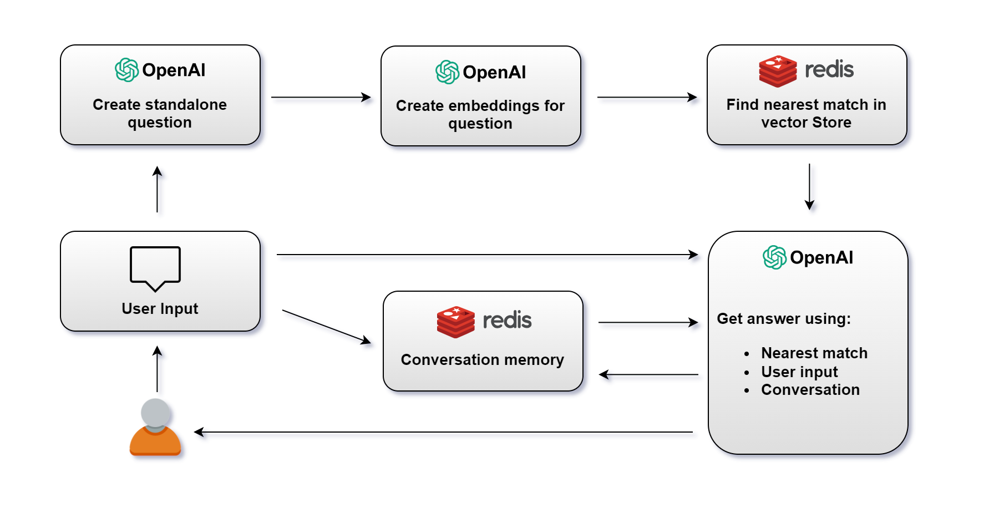

## Old RAG



### Database Setup

- **Vector Conversion and Storage**: Transform the dataset into vector representations and store them within Redis.
- **Index Creation for Vector Search**: Establish indexes to facilitate efficient vector search within the database.

### User Query Processing

- **Question Vectorization**: Convert the user's query into a 'standalone question' format.
- **Vector Search in Redis**: Transform the standalone question into a vector and conduct a vector search in Redis.
- **Combining Redis Results with OpenAI**: Utilize the results obtained from Redis, along with the original user query, and input them into OpenAI to generate a human-like answer.
- **Conversation Memory Management**: Maintain a record of the entire user-AI interaction, preserving the context for any subsequent questions.

## New Assistant API

### Initial Setup

- **Data Upload**: Begin by uploading the raw textual data pertinent to your application to OpenAI's platform. This data forms the knowledge base from which the Assistant API will draw information.

- **Assistant Setup**: Proceed to create an Assistant instance and establish a link with the previously uploaded dataset. This ensures that the Assistant uses the relevant data for processing queries.

### User Query Processing

- **Query Transformation**: Convert user inquiries into thread messages. These transformed queries are then forwarded to the Assistant API to generate relevant responses.

### Benefits

- **Eliminates Need for Vector Generation and Search**: By leveraging the Assistant API, there's no requirement to generate and search through vectors, simplifying the data retrieval process.

- **No Requirement for Conversation Memory Storage**: The API manages the conversation history internally. This feature removes the necessity to store the conversational context externally, as the thread maintained by OpenAI preserves the continuity of user and Assistant interactions.

- **Streamlined Query Processing**: The API negates the need for transforming questions or combining results from various sources. Consequently, this leads to a more streamlined architecture and quicker response times.

- **Simplified Architecture**: The overall system architecture is simplified as it relies on the robust capabilities of the Assistant API, reducing the complexity typically associated with managing and processing large datasets.

## Application

```sh
# first time
npm install

npm start
```

- Modify question in index file

```ts title="assistant-api/src/index.ts"
let sampleQuestion = "What brands do you have in store?";
await testSampleUserQuestion(
  sampleQuestion,
  openAIInstance,
  assistantId,
  threadId
);
```

```log title="Console log"
redis-wrapper  Connected successfully to Redis
New file Id : file-JloQYuRL8QWEBKW6OFeSrHFd
New assistant id : asst_CTVcYLTkgwNbT3Zph8PXbIp8
New user thread id : thread_0Dqv6icz7GZZARYsug87Dk4O
New user messageId:msg_8GWgx2KWsDJ1DJ6ABhJlQXHA
New threadRunId:run_AlD0jTZZKstVTCABRPY4pc5L
pollThreadStatus:in_progress
{
  type: 'text',
  text: {
    value: "It looks like we have a variety of products from the brand Nike available in our store. If you need help finding a specific Nike product or have any other brand preferences, let me know and I'd be happy to assist you further! \n" +
      '\n' +
      'For detailed product offerings from Nike, feel free to explore the options by clicking on any of the product names for more information:\n' +
      '- <a href="/?productId=10007">Nike Women As Trophy Swo White T-Shirts</a>\n' +
      '- <a href="/?productId=10003">Nike Women As Nike Eleme White T-Shirt</a>\n' +
      '- <a href="/?productId=10005">Nike Men As Ss Trainin Blue T-Shirts</a>\n' +
      '- <a href="/?productId=10008">Nike Men Town Navy Blue T-Shirts</a>\n' +
      '- <a href="/?productId=10010">Nike Men As Showdown F Black T-Shirts</a>\n' +
      '\n' +
      "These are just a few listings to get you started. If you're looking for a different brand or have more questions, I'm here to help!【7†source】",
    annotations: [ [Object] ]
  }
}
```
